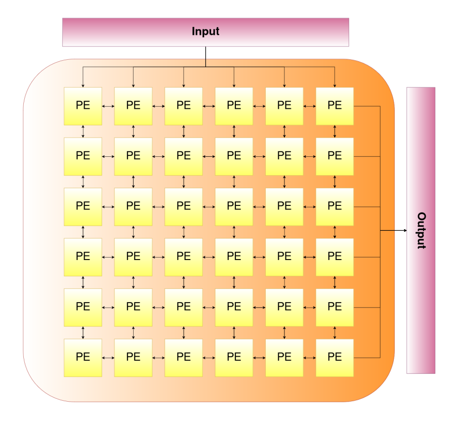

# CGRAs
CGRAs (Coarse-Grained Reconfigurable Architectures) are arrays of interconnected Processing Elements (PEs) arranged in a mesh style, offering a blend of hardware performance and software flexibility. In this architecture, each PE consists of a Cell Processing unit containing a Functional Unit (FU) surrounded by configurable routing logic. By mapping graph nodes to the FUs and configuring routing logic to establish connections between them based on the graph edges, the overlay executes a given Data Flow Graph (DFG). This overlay architecture operates on a data-driven execution model, where an FU performs an operation only when its inputs are ready and its output is available. Inputs are located in the north and outputs can be obtained from the east.
## Architecture

### Benchmarks

| Name                    | Inputs                  | Outputs               | Expression                                   |
|-------------------------|-------------------------|-----------------------|----------------------------------------------|
|           Sum           | 2 Arrays                | 1 Array               | x[i] = a[i] + b[i]                            |
|        Accumulate       | 2 Arrays                | 1 Array, 1 Scalar     | c[i] = c[i] (a[i] + b[i]) , x = x + ∑ c[i]
|           Cap           | 2 Arrays                | 1 Array               | (((a[i] * 6) >> 2) 2 ) * (((b[i] * 3 * a[i])>>2) * a[i]);
|          Mac            | 2 Arrays, 1 Scalar      | 1 Scalar              | x = x + ∑ a[i] b[i]
|           Mac2          | 4 Arrays, 2 Scalars     | 2 Scalars             |                 x = x + ∑ a[i] b[i]           , y = y + ∑a[i] (b[i] + 1)c[i] d[i] 

## Building on Ubuntu

1. Install gtkwave: `$ sudo apt-get -y install gtkwave`

2. Clone the repository.

3. Use the Makefile to run the tests. For example, <code>$ make test_name </code> where test_name can be:
    * alu-test
    * fu-test
    * join-test
    * d-eb-test
    * d-reg-test
    * fs-test
    * fr-test
    * conf-mux-test
    * d-fifo-test
    * cell-processing-test
    * processing-element-test
    * overlay-sum
    * overlay-cap
    * overlay-acc
    * overlay-mac
    * overlay-mac2

4. The VCD files are generated in the `test_run_dir` folder.

5. You can check the inputs and results of the benchmarks in the following table:

